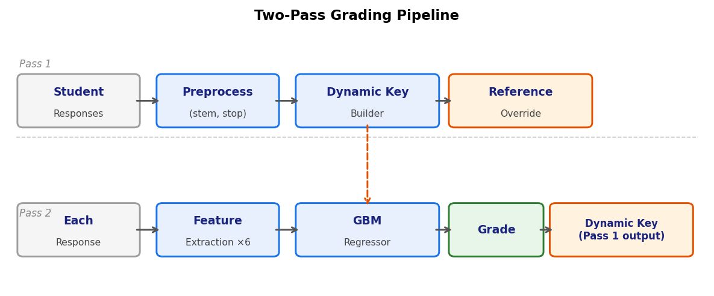
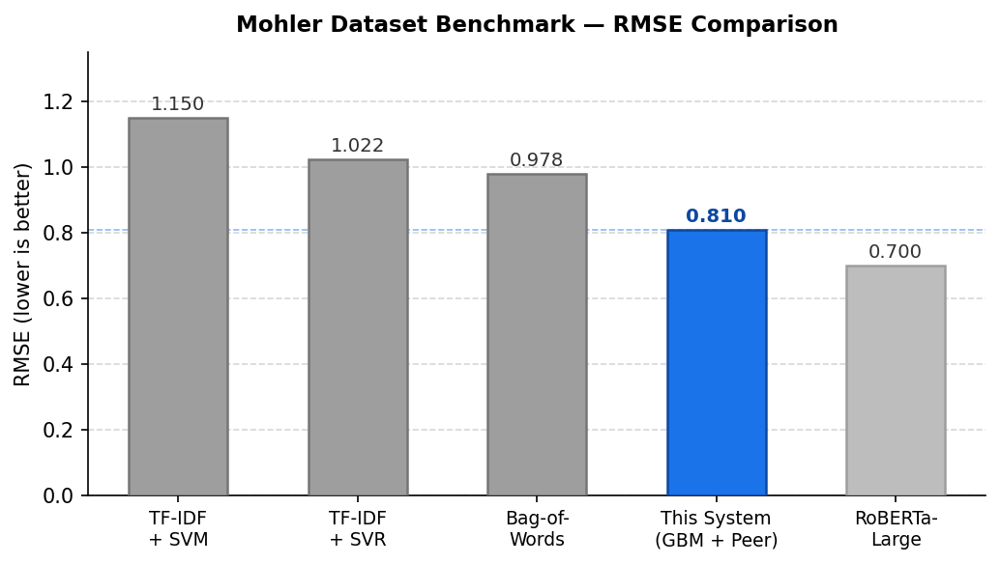

# Automated Short Answer Grading: A Peer-Aware Approach for Resource-Constrained Educational Environments
**School of Computer Science and Engineering — Winter Semester 2025–26**
**Gokularajan R, Prashitha J R | VIT University**

---

## Introduction

India's education system serves over 250 million students across 1.5 million schools. Short-answer questions—the assessments that test genuine understanding rather than recall—require a human reader for every response. A single examination sitting of 1,000 students generates 10,000 individual answers to evaluate manually.

Automated Short Answer Grading (ASAG) addresses this, but the field has moved toward transformer-based models (100M+ parameters) that require GPU clusters to train and run. Most Indian schools and colleges do not have that infrastructure. This project builds an ASAG system that achieves competitive accuracy without specialized hardware and deploys for approximately $20/month on Azure.

---

## Motivation

- **The hardware barrier.** Fine-tuned RoBERTa achieves RMSE 0.70 on standard benchmarks—but requires GPU training and cloud inference budgets that resource-constrained institutions cannot afford.
- **The static key problem.** Every existing ASAG approach evaluates responses against a fixed reference answer, ignoring the collective signal in the submission batch. Experienced teachers do not grade this way.
- **The deployment gap.** No prior ASAG system has been designed with explicit consideration for intermittent connectivity, minimal IT support, and tight operating budgets.

---

## Methodology

The system uses a **two-pass peer-aware approach**. In Pass 1, a dynamic answer key is constructed from the entire submission batch: term frequencies across all responses are scaled and blended with the reference answer (which always overrides to weight 1.0). Question words are demoted by a factor of 1.8 to penalize paraphrasing the question back.

In Pass 2, six features are extracted per response and fed into a Gradient Boosting Regressor trained on the Mohler dataset.

| Feature | What it captures |
|---------|-----------------|
| `sim_with_demotion` | Peer-aware similarity, question words demoted |
| `sim_no_demotion` | Peer-aware similarity, no demotion |
| `length_ratio` | Response length vs. reference length |
| `jaccard_unigram` | Stemmed word overlap |
| `keyword_coverage` | Fraction of reference terms present |
| `jaccard_bigram` | Phrase-level overlap (unstemmed) |

L1 normalization is used rather than L2—for short texts, L1 preserves term frequency information better. The GBM uses depth-2 trees (100 estimators, learning rate 0.1) to capture pairwise feature interactions without overfitting.



---

## Results

Evaluated on the **Mohler dataset** (79 questions, 2,264 student responses, graded 0–5).



| System | RMSE | GPU Required |
|--------|------|-------------|
| TF-IDF + SVM | 1.150 | No |
| TF-IDF + SVR | 1.022 | No |
| Bag-of-Words | 0.978 | No |
| **This system (GBM + Peer-Aware)** | **0.81** | **No** |
| Fine-tuned RoBERTa-Large | 0.70 | Yes |

The system outperforms all traditional ML baselines. The 0.11 RMSE gap from RoBERTa-Large is the cost of not using a GPU—a deliberate tradeoff for the target deployment context.

**Performance (Intel Core i5, 8 GB RAM, no GPU):**
1,000 responses graded in under 20 seconds. Single response under 50 ms.

---

## System and Deployment

A complete end-to-end application was built and deployed.

**Teacher workflow:** Create question bank → export as portable JSON → students sit exam → one-click "Grade All" → three-view dashboard (class, per-question, per-student) → CSV export.

**Student workflow:** Enter name and roll number → answer questions with auto-save and free navigation → submit.

**Deployment architecture:**
```
Browser → Azure App Service (Linux B1, single container)
              ├── FastAPI + uvicorn
              └── Azure Files mount (JSON data + model file)
```

| Service | SKU | Cost/month |
|---------|-----|-----------|
| App Service Plan | B1 | ~$13 |
| Container Registry | Basic | ~$5 |
| Azure Files | Standard LRS | ~$2 |
| **Total** | | **~$20** |

No GPU. No managed database. No specialized infrastructure.

---

## Conclusion

A peer-aware GBM approach with six features achieves RMSE 0.81 on the Mohler benchmark—better than all traditional baselines—without GPU hardware. The dynamic answer key is the primary contribution: grading criteria adapt to what the actual cohort wrote, not only to a static reference. The complete system is deployed on Azure for $20/month and runs fully offline in standalone mode on a standard laptop.

---

## References

[1] Mohler & Mihalcea (2009). Text-to-text semantic similarity for automatic short answer grading. *EACL*.

[2] Thakkar (2021). Finetuning Transformer Models to Build ASAG System. *arXiv*.

[3] Burrows, Gurevych & Stein (2014). The eras and trends of automatic short answer grading. *IJAIED*, 25(1).

[4] Mello et al. (2025). Does GPT-4 with Prompt Engineering Beat Traditional Models? *ACM LAK*.
